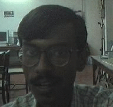

This code is about morphing one image into another via triangulization.
It asks user to feed in points via ui. Then it generates delunay meshes and morphs one image to another. It saves the intermediate images which is shown in gif below.

